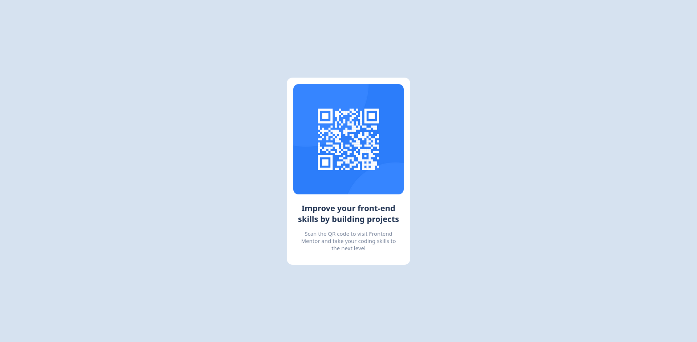

# Frontend Mentor - QR code component solution

This is a solution to the [QR code component challenge on Frontend Mentor](https://www.frontendmentor.io/challenges/qr-code-component-iux_sIO_H). Frontend Mentor challenges help you improve your coding skills by building realistic projects.

## Table of contents

- [Overview](#overview)
  - [Screenshot](#screenshot)
  - [Links](#links)
- [My process](#my-process)
  - [Built with](#built-with)
  - [What I learned](#what-i-learned)
  - [Continued development](#continued-development)
  - [Useful resources](#useful-resources)
- [Author](#author)
- [Acknowledgments](#acknowledgments)

**Note: Delete this note and update the table of contents based on what sections you keep.**

## Overview

A simple QR Code component.

### Screenshot



### Links

- Live Site URL: [Live site URL](https://qr-code-eta-blond.vercel.app/)

## My process

### Built with

- Semantic HTML5 markup
- CSS custom properties
- Flexbox
- Mobile-first workflow

### What I learned

With this project a learning a very interesting way of using images in a box.

For instance:

```html
<div class="container">
  <div class="card">
    
    <div class="text">
      <h2>Improve your front-end skills by building projects</h2>
      <p>
        Scan the QR code to visit Frontend<br />
        Mentor and take your coding skills to the next level
      </p>
    </div>
  </div>
</div>
```

```css
.container {
  max-width: 370px;
}

.card {
  padding: 18px;
  background: hsl(0, 0%, 100%);
}

.card img {
  width: 100%;
}
```

If you apply your images using this method you don't need to worries about centralizing images, different paddings or try guessing the image width.

### Continued development

I believe that cards is a very useful thing on any web page, so i'll do my best to be a PRO in building these cards.

### Useful resources

- [Youtube Video](https://www.youtube.com/watch?v=5BBYPntB-GY) - This video helped me with the idea of setting a container with a max-width and helping me to centralize my image.

## Author

- Website - [Gabriel Henrique Berlucci](https://vercel.com/gabrielberluccidevs-projects)
- Frontend Mentor - [@gabrielberluccidev](https://www.frontendmentor.io/profile/gabrielberluccidev)

## Acknowledgments

A special thanks to [Mr Coder](https://www.youtube.com/@MrCoderYt)
