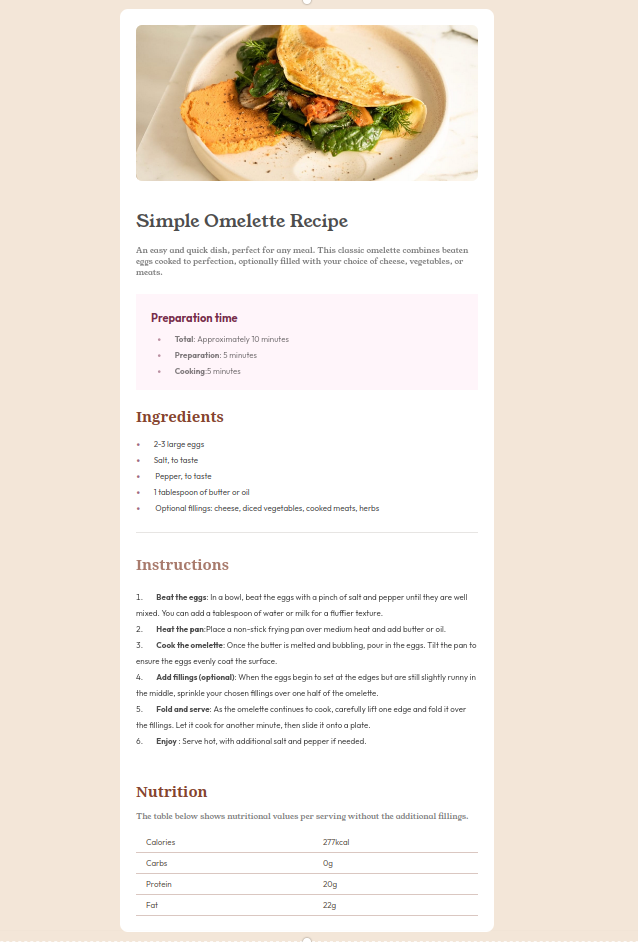

# Frontend Mentor - Recipe page solution

This is a solution to the [Recipe page challenge on Frontend Mentor](https://www.frontendmentor.io/challenges/recipe-page-KiTsR8QQKm). Frontend Mentor challenges help you improve your coding skills by building realistic projects.

## Table of contents

- [Overview](#overview)
  - [The challenge](#the-challenge)
  - [Screenshot](#screenshot)
  - [Links](#links)
- [My process](#my-process)
  - [Built with](#built-with)
  - [What I learned](#what-i-learned)
  - [Continued development](#continued-development)
  - [Useful resources](#useful-resources)
- [Author](#author)
- [Acknowledgments](#acknowledgments)

## Overview

The goal of this project was to build a simple recipe page with HTML and CSS.

### Screenshot



### Links

- Live Site URL: [Live site URL](https://recipe-page-delta-two.vercel.app/)

## My process

### Built with

- Semantic HTML5 markup
- CSS custom properties
- Flexbox
- Mobile-first workflow

### What I learned

I've learned how to create tables in HTML

To see how you can add code snippets, see below:

```html
<table>
  <tr>
    <td>Calories</td>
    <td class="numbers">277kcal</td>
  </tr>
  <tr>
    <td>Carbs</td>
    <td class="numbers">0g</td>
  </tr>
  <tr>
    <td>Protein</td>
    <td class="numbers">20g</td>
  </tr>
  <tr>
    <td>Fat</td>
    <td class="numbers">22g</td>
  </tr>
</table>
```

## Author

- Website - [Gabriel Henrique Berlucci](https://github.com/gabrielberluccidev/)
- Frontend Mentor - [@gabrielberluccidev](https://www.frontendmentor.io/profile/gabrielberluccidev)
